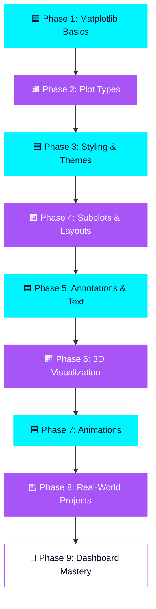

<div align="center">

<!-- ============================================================ -->
<!--                     HERO BANNER (SVG)                        -->
<!-- ============================================================ -->

<svg width="100%" height="280" viewBox="0 0 1200 280" xmlns="http://www.w3.org/2000/svg">
  <defs>
    <linearGradient id="heroBg" x1="0%" y1="0%" x2="100%" y2="100%">
      <stop offset="0%" style="stop-color:#0f0c29"/>
      <stop offset="50%" style="stop-color:#302b63"/>
      <stop offset="100%" style="stop-color:#24243e"/>
    </linearGradient>
    <linearGradient id="neonText" x1="0%" y1="0%" x2="100%" y2="0%">
      <stop offset="0%" style="stop-color:#00f5ff"/>
      <stop offset="50%" style="stop-color:#a855f7"/>
      <stop offset="100%" style="stop-color:#00f5ff"/>
    </linearGradient>
    <filter id="glow">
      <feGaussianBlur stdDeviation="6" result="coloredBlur"/>
      <feMerge>
        <feMergeNode in="coloredBlur"/>
        <feMergeNode in="SourceGraphic"/>
      </feMerge>
    </filter>
  </defs>
  <rect width="1200" height="280" fill="url(#heroBg)" rx="24"/>
  <circle cx="120" cy="60" r="80" fill="#a855f7" opacity="0.15"/>
  <circle cx="1100" cy="220" r="100" fill="#00f5ff" opacity="0.12"/>
  <text x="600" y="120" font-family="Segoe UI, sans-serif" font-size="58" font-weight="800" fill="url(#neonText)" text-anchor="middle" filter="url(#glow)">📊 MATPLOTLIB NOTES</text>
  <text x="600" y="170" font-family="Segoe UI, sans-serif" font-size="22" fill="#e0e0ff" text-anchor="middle" opacity="0.85">Master Data Visualization in Python — From Zero to Mastery</text>
  <text x="600" y="210" font-family="Segoe UI, sans-serif" font-size="15" fill="#00f5ff" text-anchor="middle" opacity="0.7">✦ Neon-Grade Learning Repository ✦ Built for Students, Engineers &amp; Data Scientists ✦</text>
</svg>

<!-- ============================================================ -->
<!--                  ANIMATED TYPING HEADER                      -->
<!-- ============================================================ -->

<a href="https://github.com/Muhammad-Mawiya/Matplotlib-Notes">
  
</a>

<br/>

<!-- ============================================================ -->
<!--                     PREMIUM BADGES                           -->
<!-- ============================================================ -->

<p>
  
  
  
  
</p>

<p>
  
  
  
  
</p>

<p>
  
</p>

</div>

<!-- SVG DIVIDER -->
<svg width="100%" height="6"><rect width="100%" height="6" fill="url(#neonText)"/></svg>

<br/>

## 🌌 Repository Overview

<div align="center">

> ### *"Data visualization is not about pretty pictures — it's about clarity, insight, and impact."*

</div>

**Matplotlib Notes** is a meticulously crafted, ultra-organized knowledge base for mastering **Matplotlib** — Python's most powerful and flexible data visualization library. This repository takes you on a structured journey from foundational plotting concepts to advanced dashboard-grade visualizations, blending **theory + hands-on code + real datasets**.

<table align="center">
<tr>
<td align="center" width="25%">

### 🎯
**Purpose**
Learn Matplotlib deeply & practically

</td>
<td align="center" width="25%">

### 🧠
**Level**
Beginner → Advanced

</td>
<td align="center" width="25%">

### 🧩
**Format**
Notebooks + Scripts + Notes

</td>
<td align="center" width="25%">

### ⚡
**Style**
Clean, Commented, Reusable

</td>
</tr>
</table>

<svg width="100%" height="4"><rect width="100%" height="4" fill="#a855f7" opacity="0.4"/></svg>

<br/>

## ✨ Features

<table align="center" width="100%">
<tr>
<td width="50%" valign="top">

### 📐 Structured Learning
Concepts organized from fundamentals to advanced customization, in a clear logical order.

### 🎨 Rich Visual Styling
Themes, colormaps, custom styles & glassmorphism-inspired chart aesthetics.

### 🧪 Real Datasets
Practice with real-world CSVs, not just toy arrays.

### 🚀 Performance Tips
Learn how to render large datasets efficiently.

</td>
<td width="50%" valign="top">

### 📊 All Chart Types Covered
Line, Bar, Scatter, Pie, Histogram, Heatmap, 3D & more.

### 🧵 Subplots & Layouts
Master `GridSpec`, multi-axes figures & dashboards.

### 🎬 Animations
Build animated plots using `FuncAnimation`.

### 🧠 Best Practices
Industry-grade visualization guidelines included.

</td>
</tr>
</table>

<svg width="100%" height="4"><rect width="100%" height="4" fill="#00f5ff" opacity="0.4"/></svg>

<br/>

## 🗺️ Learning Roadmap

<div align="center">



</div>

<svg width="100%" height="4"><rect width="100%" height="4" fill="#a855f7" opacity="0.4"/></svg>

<br/>

## 📚 Topics Covered

<table align="center">
<tr>
<th>📁 Module</th>
<th>📝 Description</th>
<th>🎯 Level</th>
</tr>
<tr>
<td>🔹 Figure & Axes</td>
<td>Understanding the Matplotlib object hierarchy</td>
<td>🟢 Beginner</td>
</tr>
<tr>
<td>🔹 Line & Bar Charts</td>
<td>Trend analysis & categorical comparisons</td>
<td>🟢 Beginner</td>
</tr>
<tr>
<td>🔹 Scatter & Bubble Plots</td>
<td>Correlation & multi-dimensional data</td>
<td>🟡 Intermediate</td>
</tr>
<tr>
<td>🔹 Histograms & KDE</td>
<td>Distribution analysis</td>
<td>🟡 Intermediate</td>
</tr>
<tr>
<td>🔹 Subplots & GridSpec</td>
<td>Multi-panel dashboard layouts</td>
<td>🟡 Intermediate</td>
</tr>
<tr>
<td>🔹 Colormaps & Themes</td>
<td>Custom styling & branding for charts</td>
<td>🟡 Intermediate</td>
</tr>
<tr>
<td>🔹 3D Plotting</td>
<td>Surface, wireframe & 3D scatter plots</td>
<td>🔴 Advanced</td>
</tr>
<tr>
<td>🔹 Animations</td>
<td>Dynamic, time-based visualizations</td>
<td>🔴 Advanced</td>
</tr>
<tr>
<td>🔹 Real-World Projects</td>
<td>End-to-end visualization case studies</td>
<td>🔴 Advanced</td>
</tr>
</table>

<svg width="100%" height="4"><rect width="100%" height="4" fill="#00f5ff" opacity="0.4"/></svg>

<br/>

## 📁 Folder Structure

```bash
Matplotlib-Notes/
│
├── 📂 01_Basics/
│   ├── figure_and_axes.ipynb
│   ├── first_plot.ipynb
│   └── notes.md
│
├── 📂 02_Plot_Types/
│   ├── line_charts.ipynb
│   ├── bar_charts.ipynb
│   ├── scatter_plots.ipynb
│   ├── pie_charts.ipynb
│   └── histograms.ipynb
│
├── 📂 03_Styling_Themes/
│   ├── colormaps.ipynb
│   ├── custom_styles.ipynb
│   └── glassmorphism_theme.py
│
├── 📂 04_Subplots_Layouts/
│   ├── gridspec_layouts.ipynb
│   └── dashboard_layout.ipynb
│
├── 📂 05_Annotations_Text/
│   └── annotations.ipynb
│
├── 📂 06_3D_Visualization/
│   └── 3d_plots.ipynb
│
├── 📂 07_Animations/
│   └── animated_plots.ipynb
│
├── 📂 08_Real_World_Projects/
│   ├── sales_dashboard.ipynb
│   ├── covid_data_analysis.ipynb
│   └── stock_market_viz.ipynb
│
├── 📂 assets/
│   ├── screenshots/
│   └── gifs/
│
├── requirements.txt
├── LICENSE
└── README.md
```

<svg width="100%" height="4"><rect width="100%" height="4" fill="#a855f7" opacity="0.4"/></svg>

<br/>

## ⚙️ Installation Guide

> 💡 **Callout:** Make sure Python 3.10+ is installed before proceeding.

**1️⃣ Clone the repository**

```bash
git clone https://github.com/Muhammad-Mawiya/Matplotlib-Notes.git
cd Matplotlib-Notes
```

**2️⃣ Create a virtual environment**

```bash
python -m venv venv
source venv/bin/activate      # macOS/Linux
venv\Scripts\activate         # Windows
```

**3️⃣ Install dependencies**

```bash
pip install -r requirements.txt
```

**4️⃣ Launch Jupyter Notebook**

```bash
jupyter notebook
```

<svg width="100%" height="4"><rect width="100%" height="4" fill="#00f5ff" opacity="0.4"/></svg>

<br/>

## 🚀 Quick Start

```python
import matplotlib.pyplot as plt
import numpy as np

x = np.linspace(0, 10, 100)
y = np.sin(x)

plt.figure(figsize=(8, 5))
plt.plot(x, y, color="#00f5ff", linewidth=2.5, label="sin(x)")
plt.title("Quick Start: Neon Sine Wave", fontsize=14, color="#a855f7")
plt.legend()
plt.grid(alpha=0.2)
plt.show()
```

<svg width="100%" height="4"><rect width="100%" height="4" fill="#a855f7" opacity="0.4"/></svg>

<br/>

## 💻 Sample Code — Glassmorphism-Style Chart

```python
import matplotlib.pyplot as plt
import numpy as np

plt.style.use("dark_background")
fig, ax = plt.subplots(figsize=(9, 5.5))

categories = ["Jan", "Feb", "Mar", "Apr", "May"]
values = [23, 45, 12, 67, 34]

bars = ax.bar(categories, values, color="#00f5ff", alpha=0.8, edgecolor="#a855f7", linewidth=1.5)

ax.set_facecolor("#0f0c29")
fig.patch.set_facecolor("#0f0c29")
ax.set_title("Monthly Performance", fontsize=16, color="white", pad=20)
ax.spines[["top", "right"]].set_visible(False)
ax.grid(axis="y", alpha=0.15)

for bar in bars:
    height = bar.get_height()
    ax.text(bar.get_x() + bar.get_width()/2, height + 1,
             f"{height}", ha="center", color="#a855f7", fontweight="bold")

plt.tight_layout()
plt.savefig("assets/screenshots/glass_bar_chart.png", dpi=200, transparent=True)
plt.show()
```

<svg width="100%" height="4"><rect width="100%" height="4" fill="#00f5ff" opacity="0.4"/></svg>

<br/>

## 🖼️ Gallery

<div align="center">
<table>
<tr>
<td align="center"><br/><b>Line Chart</b></td>
<td align="center"><br/><b>Bar Chart</b></td>
<td align="center"><br/><b>Scatter Plot</b></td>
</tr>
<tr>
<td align="center"><br/><b>Heatmap</b></td>
<td align="center"><br/><b>3D Surface Plot</b></td>
<td align="center"><br/><b>Dashboard Layout</b></td>
</tr>
</table>
</div>

<svg width="100%" height="4"><rect width="100%" height="4" fill="#a855f7" opacity="0.4"/></svg>

<br/>

## 📸 Screenshots

> 📌 *Replace these placeholders with your own exported chart images inside `assets/screenshots/`.*

<div align="center">


</div>

<svg width="100%" height="4"><rect width="100%" height="4" fill="#00f5ff" opacity="0.4"/></svg>

<br/>

## 🎬 GIF Preview

<div align="center">

<p><i>✨ Live animated Matplotlib visualization — replace with your own exported GIF.</i></p>
</div>

<svg width="100%" height="4"><rect width="100%" height="4" fill="#a855f7" opacity="0.4"/></svg>

<br/>

## 📖 Resources

| 🔗 Resource | 📄 Description |
|---|---|
| [Official Matplotlib Docs](https://matplotlib.org/stable/index.html) | Complete API reference |
| [Matplotlib Cheatsheets](https://matplotlib.org/cheatsheets/) | Quick visual reference guide |
| [Real Python – Matplotlib Guide](https://realpython.com/python-matplotlib-guide/) | In-depth tutorials |
| [Awesome Data Visualization](https://github.com/fasouto/awesome-dataviz) | Curated visualization resources |
| [Python Graph Gallery](https://python-graph-gallery.com/matplotlib/) | Inspiration & examples |

<svg width="100%" height="4"><rect width="100%" height="4" fill="#00f5ff" opacity="0.4"/></svg>

<br/>

## ❓ FAQ

<details>
<summary><b>🔹 Do I need prior Python experience?</b></summary><br/>
Basic Python knowledge (variables, loops, functions) is recommended. No prior visualization experience needed.
</details>

<details>
<summary><b>🔹 Is this repository suitable for beginners?</b></summary><br/>
Absolutely! The roadmap starts from absolute basics and progresses to advanced topics.
</details>

<details>
<summary><b>🔹 Can I use these notes for teaching or workshops?</b></summary><br/>
Yes, under the MIT License, feel free to use and adapt with attribution.
</details>

<details>
<summary><b>🔹 Does this cover Seaborn or Plotly?</b></summary><br/>
This repository is Matplotlib-focused, but concepts translate well to other libraries.
</details>

<details>
<summary><b>🔹 How do I contribute new notebooks?</b></summary><br/>
Check the Contribution Guide section below for the full workflow.
</details>

<svg width="100%" height="4"><rect width="100%" height="4" fill="#a855f7" opacity="0.4"/></svg>

<br/>

## 💎 Why This Repository?

> 💡 **Callout:** Most tutorials show *how* to plot. This repository teaches you *why* and *when* to use each visualization.

- 🧠 **Depth over breadth** — every concept explained with reasoning, not just syntax
- 🎨 **Design-first mindset** — visualization aesthetics matter as much as accuracy
- 🧩 **Modular notebooks** — study any topic independently
- 🌍 **Real datasets** — practical, not toy examples
- 🔄 **Continuously updated** — new charts and techniques added regularly

<svg width="100%" height="4"><rect width="100%" height="4" fill="#00f5ff" opacity="0.4"/></svg>

<br/>

## 🎓 Learning Outcomes

By completing this repository, you will be able to:

- ✅ Build any standard chart type from scratch in Matplotlib
- ✅ Design publication-quality, styled visualizations
- ✅ Create multi-panel dashboards using subplots & GridSpec
- ✅ Apply custom color themes and branding to charts
- ✅ Build animated and 3D visualizations
- ✅ Translate raw data into clear visual storytelling
- ✅ Optimize plots for performance and readability

<svg width="100%" height="4"><rect width="100%" height="4" fill="#a855f7" opacity="0.4"/></svg>

<br/>

## 🏆 Best Practices

| ✅ Do | ❌ Avoid |
|---|---|
| Use clear titles & axis labels | Leaving axes unlabeled |
| Choose colorblind-friendly palettes | Overusing bright clashing colors |
| Keep charts minimal & focused | Cluttering with excessive gridlines |
| Use consistent font sizing | Mixing inconsistent typography |
| Export at high DPI (200+) | Using low-resolution exports |
| Add legends when needed | Omitting context for multiple series |

<svg width="100%" height="4"><rect width="100%" height="4" fill="#00f5ff" opacity="0.4"/></svg>

<br/>

## 💡 Tips & Tricks

- 🎯 Use `plt.tight_layout()` to auto-fix spacing issues
- 🎨 Use `plt.style.use("dark_background")` for neon-themed charts
- ⚡ Use `ax.spines[[...]].set_visible(False)` to remove chart clutter
- 🧵 Use `fig, axes = plt.subplots(nrows, ncols)` for dashboards
- 🖼️ Always export with `dpi=200` or higher for crisp visuals
- 🔁 Use `FuncAnimation` for lightweight, smooth animations

<svg width="100%" height="4"><rect width="100%" height="4" fill="#a855f7" opacity="0.4"/></svg>

<br/>

## 🤝 Contribution Guide

Contributions are warmly welcome! Here's how to get started:

```bash
# 1. Fork this repository
# 2. Create your feature branch
git checkout -b feature/new-chart-notebook

# 3. Commit your changes
git commit -m "Add: new heatmap visualization notebook"

# 4. Push to your branch
git push origin feature/new-chart-notebook

# 5. Open a Pull Request 🎉
```

> 💡 **Callout:** Please follow the existing notebook structure and add clear markdown explanations alongside code cells.

<svg width="100%" height="4"><rect width="100%" height="4" fill="#00f5ff" opacity="0.4"/></svg>

<br/>

## 📜 License

This project is licensed under the **MIT License** — see the [LICENSE](LICENSE) file for details.

<svg width="100%" height="4"><rect width="100%" height="4" fill="#a855f7" opacity="0.4"/></svg>

<br/>

## 📊 GitHub Analytics

<div align="center">


<br/>


<br/><br/>


</div>

<svg width="100%" height="4"><rect width="100%" height="4" fill="#00f5ff" opacity="0.4"/></svg>

<br/>

## 🐍 Contribution Snake Animation

<div align="center">


<sub>⚙️ Powered by <a href="https://github.com/Platane/snk">Platane/snk</a> — auto-generated via GitHub Actions</sub>

</div>

<svg width="100%" height="4"><rect width="100%" height="4" fill="#a855f7" opacity="0.4"/></svg>

<br/>

## 📬 Contact

<div align="center">

| Platform | Link |
|---|---|
| 📧 Email | muhammad.mawiya@example.com |
| 💼 LinkedIn | [linkedin.com/in/muhammad-mawiya](https://linkedin.com) |
| 🐙 GitHub | [github.com/Muhammad-Mawiya](https://github.com/Muhammad-Mawiya) |
| 🐦 Twitter / X | [@muhammadmawiya](https://twitter.com) |

</div>

<svg width="100%" height="4"><rect width="100%" height="4" fill="#00f5ff" opacity="0.4"/></svg>

<br/>

## 🌐 Social Links

<div align="center">

<a href="https://github.com/Muhammad-Mawiya"></a>
<a href="https://linkedin.com"></a>
<a href="https://twitter.com"></a>
<a href="mailto:muhammad.mawiya@example.com"></a>

</div>

<br/>

<!-- ============================================================ -->
<!--                     FOOTER BANNER (SVG)                      -->
<!-- ============================================================ -->

<div align="center">

<svg width="100%" height="180" viewBox="0 0 1200 180" xmlns="http://www.w3.org/2000/svg">
  <defs>
    <linearGradient id="footerBg" x1="0%" y1="0%" x2="100%" y2="0%">
      <stop offset="0%" style="stop-color:#24243e"/>
      <stop offset="50%" style="stop-color:#302b63"/>
      <stop offset="100%" style="stop-color:#0f0c29"/>
    </linearGradient>
    <linearGradient id="footerText" x1="0%" y1="0%" x2="100%" y2="0%">
      <stop offset="0%" style="stop-color:#a855f7"/>
      <stop offset="100%" style="stop-color:#00f5ff"/>
    </linearGradient>
  </defs>
  <rect width="1200" height="180" fill="url(#footerBg)" rx="24"/>
  <text x="600" y="80" font-family="Segoe UI, sans-serif" font-size="30" font-weight="700" fill="url(#footerText)" text-anchor="middle">⭐ If this repository helped you, consider starring it! ⭐</text>
  <text x="600" y="130" font-family="Segoe UI, sans-serif" font-size="18" fill="#e0e0ff" text-anchor="middle" opacity="0.85">Made with ❤️ by Muhammad Mawiya</text>
</svg>

<sub>© 2026 Matplotlib Notes — Crafted for the community of learners and builders.</sub>

</div>
